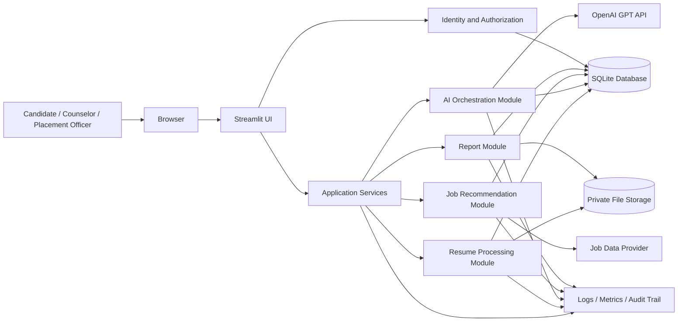
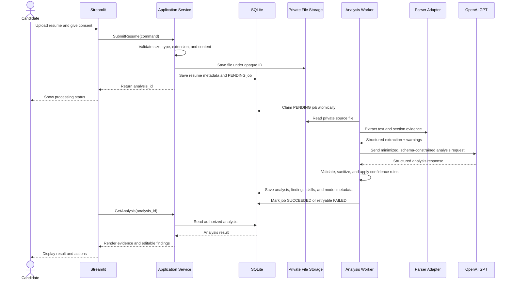
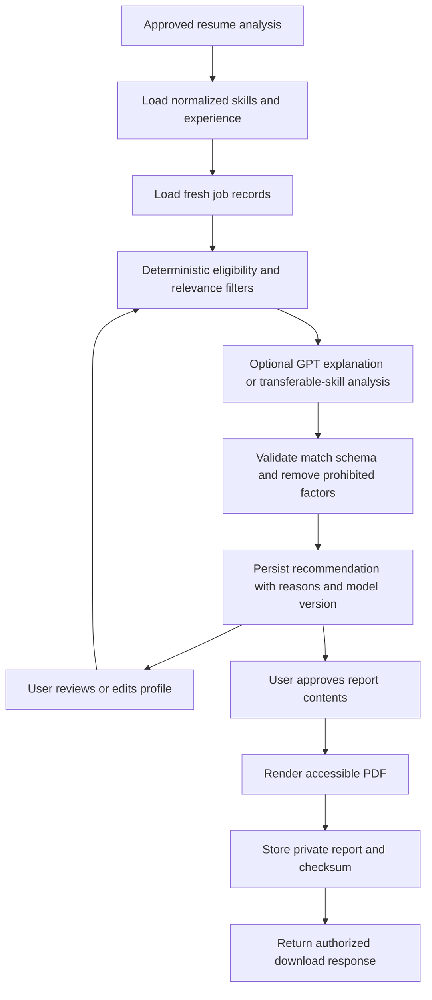

# AI Resume Analyzer: Production Architecture

**Status:** Proposed architecture  
**Date:** 19 August 2026  
**Primary stack:** Streamlit, Python, OpenAI GPT, SQLite, Pytest

## 1. Architecture Principles

1. **Privacy by design:** Resumes, extracted personal data, prompts, and generated reports are sensitive data. Minimize collection, encrypt storage and transport, and never log raw resume content by default.
2. **Human control:** AI output is advisory. Users can review, edit, confirm, dismiss, and report incorrect findings.
3. **Explainability:** Every recommendation and material finding should be traceable to resume evidence, job requirements, rules, or a model version.
4. **Structured AI output:** GPT is used behind typed schemas and validation, not as an unbounded source of application state.
5. **Replaceable integrations:** OpenAI, job data providers, file parsers, and report renderers are ports with adapters.
6. **Safe degradation:** A provider outage must produce a clear retryable state and must not corrupt a prior analysis.
7. **Modular monolith first:** The MVP can deploy as one Python application, while internal boundaries allow later extraction of workers or services.

## 2. High-Level Architecture

The system is a modular monolith with a Streamlit presentation layer and a Python application layer. SQLite is the system of record for metadata, structured analysis, user decisions, consent, audit events, and job data. Original resumes and generated PDFs should be stored in a private filesystem or object-storage adapter; SQLite stores their opaque references and checksums rather than large binary payloads.



### Runtime topology

- **Web process:** Streamlit app serving the UI and short request orchestration.
- **Analysis execution:** A durable job boundary is required for production. For a single-instance deployment, this can start as a SQLite-backed job table consumed by a dedicated worker process. Do not rely on Streamlit session threads for durable work.
- **Worker process:** Claims analysis jobs, performs parsing and AI calls, persists state transitions, and releases or retries jobs.
- **SQLite:** Shared database file on reliable local storage for a small deployment. Enable WAL mode, foreign keys, busy timeout, and controlled connection handling.
- **File storage:** Private local volume for a single host or an object-storage adapter for multiple instances. Do not serve resume paths directly from the web root.
- **External providers:** OpenAI for analysis and generation; an approved job feed or provider for job data. Both must be accessed through adapter interfaces.

### Important SQLite production boundary

SQLite is appropriate for an MVP or a low-to-moderate single-writer deployment. It is not a strong fit for many concurrent writers, multiple application hosts, or high-volume background processing. Before horizontal scaling, move persistence to a server database such as PostgreSQL behind the same repository interfaces. The application must avoid SQLite-specific assumptions outside the infrastructure layer.

## 3. Component Diagram

```mermaid
flowchart TB
    subgraph Presentation[Presentation Layer]
        Pages[Streamlit Pages]
        Session[Session State Adapter]
        Components[Reusable UI Components]
    end

    subgraph Application[Application Layer]
        Submit[Submit Resume Service]
        Analyze[Run Analysis Service]
        Recommend[Generate Recommendations Service]
        Improve[Generate Improvements Service]
        Share[Share and Consent Service]
        Export[Generate Report Service]
    end

    subgraph Domain[Domain Layer]
        ResumeModel[Resume and Experience Models]
        AnalysisModel[Analysis and Finding Models]
        SkillModel[Skill and Skill Gap Models]
        JobModel[Job and Match Models]
        Policy[Scoring, Consent, and Access Policies]
    end

    subgraph Infrastructure[Infrastructure Layer]
        ResumeParser[PDF / DOCX Parser Adapters]
        OCR[Optional OCR Adapter]
        OpenAIAdapter[OpenAI GPT Adapter]
        JobAdapter[Job Provider Adapter]
        Repositories[SQLite Repositories]
        Storage[File Storage Adapter]
        PDF[PDF Renderer]
        Identity[Authentication Adapter]
        Telemetry[Structured Logging and Metrics]
    end

    Pages --> Session
    Pages --> Components
    Pages --> Submit
    Pages --> Analyze
    Pages --> Recommend
    Pages --> Improve
    Pages --> Share
    Pages --> Export

    Submit --> ResumeModel
    Analyze --> AnalysisModel
    Recommend --> JobModel
    Improve --> AnalysisModel
    Share --> Policy
    Export --> AnalysisModel

    Submit --> ResumeParser
    ResumeParser --> OCR
    Analyze --> OpenAIAdapter
    Recommend --> JobAdapter
    Submit --> Repositories
    Analyze --> Repositories
    Recommend --> Repositories
    Share --> Repositories
    Export --> PDF
    Export --> Storage
    Application --> Identity
    Application --> Telemetry
```



### Component responsibilities

| Component | Responsibility | Must not do |
|---|---|---|
| Streamlit pages | Render state, collect input, invoke application services, display errors | Call OpenAI, SQL, or filesystem APIs directly |
| Application services | Coordinate a use case, authorization, transactions, and state changes | Contain provider-specific parsing or prompt details |
| Domain models | Represent validated resume, analysis, skill, job, and report concepts | Depend on Streamlit, OpenAI SDK, or SQLite |
| AI orchestrator | Build versioned prompts, call GPT, validate structured output, record model metadata | Persist arbitrary unvalidated model output |
| Resume parser | Extract text and sections from PDF/DOCX and return evidence | Generate recommendations or silently invent missing fields |
| Recommendation engine | Match candidate evidence to normalized job requirements and explain fit | Use protected attributes or opaque untraceable scores |
| Repositories | Persist and retrieve domain records | Apply UI rules or make network calls |
| File storage | Store and retrieve private source/report files by opaque key | Expose direct public paths |
| Report renderer | Render approved analysis into accessible PDF | Re-run AI generation while exporting |
| Worker | Process durable jobs with retries and idempotency | Assume a Streamlit session is still alive |

## 4. Data Flow Diagram

### Primary resume analysis flow



### Recommendation and report flow



### Data handling rules

- Store source files separately from structured analysis.
- Store only the minimum resume text needed for evidence display; apply a configurable retention policy.
- Hash uploaded files for deduplication and integrity checks; do not use the hash as an authorization token.
- Keep prompt version, model name, response ID where available, token usage, and validation outcome with each AI operation.
- Store user edits as explicit decisions or revisions so the original AI output remains auditable.

## 5. Recommended Folder Structure

```text
Resume-Analyser-19-08-2026/
|-- app.py                         # Streamlit entry point; composition only
|-- pyproject.toml                 # Dependencies, tooling, test configuration
|-- README.md
|-- Product_discovery.md
|-- Architecture.md
|-- .env.example
|-- .gitignore
|-- src/
|   |-- resume_analyzer/
|       |-- __init__.py
|       |-- config.py              # Typed settings; environment-backed
|       |-- container.py           # Dependency composition root
|       |-- presentation/
|       |   |-- __init__.py
|       |   |-- pages/
|       |   |   |-- home.py
|       |   |   |-- upload.py
|       |   |   |-- analysis.py
|       |   |   |-- recommendations.py
|       |   |   |-- reports.py
|       |   |-- components/
|       |       |-- upload_widget.py
|       |       |-- analysis_panels.py
|       |       |-- status.py
|       |       |-- errors.py
|       |-- application/
|       |   |-- __init__.py
|       |   |-- commands.py        # Use-case input DTOs
|       |   |-- queries.py         # Read DTOs
|       |   |-- services/
|       |       |-- submit_resume.py
|       |       |-- analyze_resume.py
|       |       |-- recommend_jobs.py
|       |       |-- improve_resume.py
|       |       |-- share_report.py
|       |       |-- generate_report.py
|       |       |-- delete_user_data.py
|       |-- domain/
|       |   |-- __init__.py
|       |   |-- entities.py        # Resume, Analysis, Job, Report
|       |   |-- value_objects.py   # IDs, confidence, score, date ranges
|       |   |-- enums.py
|       |   |-- policies.py        # Consent, access, fairness rules
|       |   |-- ports.py           # Repository and provider protocols
|       |   |-- exceptions.py
|       |-- infrastructure/
|       |   |-- persistence/
|       |   |   |-- sqlite.py
|       |   |   |-- migrations/
|       |   |   |-- repositories/
|       |   |-- parsing/
|       |   |   |-- pdf_parser.py
|       |   |   |-- docx_parser.py
|       |   |   |-- ocr_adapter.py
|       |   |-- ai/
|       |   |   |-- openai_client.py
|       |   |   |-- prompts/
|       |   |   |-- schemas.py
|       |   |   |-- guardrails.py
|       |   |-- jobs/
|       |   |   |-- provider_adapter.py
|       |   |   |-- normalizer.py
|       |   |-- storage/
|       |   |   |-- file_store.py
|       |   |-- reporting/
|       |   |   |-- pdf_renderer.py
|       |   |-- auth/
|       |   |   |-- provider.py
|       |   |-- observability/
|       |       |-- logging.py
|       |       |-- metrics.py
|       |-- worker/
|           |-- runner.py          # Durable analysis job consumer
|           |-- handlers.py
|-- tests/
|   |-- unit/
|   |-- application/
|   |-- integration/
|   |-- contract/
|   |-- security/
|   |-- fixtures/
|-- data/
|   |-- .gitkeep                   # Runtime data; never commit resumes or DB files
|-- scripts/
|   |-- run_worker.py
|   |-- migrate.py
```

### Dependency direction

`presentation -> application -> domain <- infrastructure`.

The domain defines protocols in `ports.py`; infrastructure implements them. This prevents provider SDKs and database details from leaking into business logic and keeps most tests fast and offline.

## 6. Design Patterns

### Hexagonal architecture / ports and adapters

Use domain ports for repositories, file storage, resume parsing, LLM access, job feeds, authentication, and report rendering. The OpenAI SDK and SQLite driver are infrastructure details. This is the main pattern that enables provider replacement and deterministic tests.

### Modular monolith

Group code by business capability while deploying one application and one worker initially. This reduces operational overhead without creating a large unstructured codebase. Candidate analysis, recommendations, reporting, and sharing have explicit service boundaries.

### Command-query separation

Write operations use application commands and return identifiers or result objects. Read operations use queries and read DTOs optimized for Streamlit rendering. This prevents UI code from depending on persistence entities.

### Repository pattern and Unit of Work

Repositories encapsulate SQLite queries. A Unit of Work or explicit transaction context commits state changes atomically, particularly for job state, analysis records, and audit events.

### Strategy pattern

Use strategies for PDF versus DOCX parsing, OCR fallback, recommendation scoring, storage backends, and report formats. Select a strategy using configuration and file metadata rather than branching throughout application services.

### Adapter and Anti-Corruption Layer

Normalize OpenAI responses and external job records into internal schemas. Provider-specific fields, errors, rate limits, and naming conventions must not become part of the domain model.

### State machine

Analysis jobs should use explicit states:

`PENDING -> PROCESSING -> SUCCEEDED`

`PROCESSING -> RETRY_WAIT -> PROCESSING`

`PROCESSING -> FAILED`

`PENDING / PROCESSING -> CANCELLED`

Each transition should be validated, timestamped, and idempotent.

### Outbox-style audit recording

For important events such as consent, report sharing, deletion, and job completion, write the business change and audit event in the same SQLite transaction. A later event publisher can be added if external notifications are introduced.

### Resilience patterns

Use bounded timeouts, exponential backoff with jitter, retry budgets, circuit breaking for repeated provider failures, and idempotency keys for analysis submissions. Never retry malformed AI responses indefinitely.

## 7. Security Considerations

### Identity and authorization

- Require authentication for resume upload, analysis access, report download, sharing, and deletion.
- Enforce object-level authorization on every `resume_id`, `analysis_id`, and `report_id`; never trust IDs supplied by the browser.
- Use roles such as candidate, counselor, and placement officer with least privilege.
- For shared reports, use random, expiring, revocable tokens and a separate authorization check.
- Use secure session configuration, CSRF protections appropriate to the deployment, and secure cookies when authentication is external.

### File and content security

- Allow only PDF and DOCX using both extension and detected content type.
- Enforce maximum file size, page count, decompressed size, and processing time.
- Malware-scan uploads before parsing; reject encrypted or malformed archives unless explicitly supported.
- Treat extracted resume text as untrusted input. Prompt-injection text inside a resume must not override system instructions or authorize tools.
- Keep source files and generated reports outside public static directories with restrictive permissions.

### AI security and safety

- Send only required data to OpenAI and configure provider data-retention controls appropriate to the deployment.
- Use separate system instructions, structured schemas, and output validation.
- Do not allow model output to execute code, issue SQL, access files, or call arbitrary URLs.
- Redact or minimize sensitive fields where they are not required for the requested operation.
- Apply maximum token, timeout, and cost limits per operation and per user.
- Validate that generated claims are supported by extracted evidence; flag unsupported output rather than silently accepting it.
- Record model and prompt versions without storing full prompts or responses in logs.

### Privacy and compliance

- Obtain explicit consent before processing and separate consent before sharing with counselors or using data for improvement.
- Provide data export and deletion workflows and document retention periods.
- Do not infer or use protected characteristics for scoring or recommendations.
- Keep an immutable audit trail for access, sharing, consent changes, and deletion requests while minimizing personal data in audit fields.
- Define incident response for accidental disclosure, provider misuse, and unauthorized access.

### Database and secrets

- Keep `.env` files, API keys, database files, uploaded resumes, and generated reports out of version control.
- Load secrets from environment variables or a secret manager; never put the OpenAI key in Streamlit code or client-side state.
- Use parameterized SQL and database constraints.
- Back up the SQLite database and file storage together, encrypt backups, test restores, and restrict backup access.
- Use WAL, foreign keys, busy timeout, and a single connection policy per process.

## 8. Logging and Observability Strategy

### Log levels

- **DEBUG:** Local development details only; disabled or tightly restricted in production.
- **INFO:** Job accepted, state transitions, provider latency, report generated, and successful deletion.
- **WARNING:** Low-confidence extraction, retryable provider failure, stale job data, rejected file, or degraded feature.
- **ERROR:** Unhandled application error, failed transaction, exhausted retry, or security control failure.
- **CRITICAL:** Data-integrity, authorization, or availability incident requiring immediate response.

### Structured event fields

Every event should include:

- `timestamp` in UTC
- `level`
- `event_name`
- `request_id`
- `user_id_hash` or internal opaque user ID where necessary
- `analysis_id` or `job_id` where applicable
- `component`
- `duration_ms`
- `status`
- `error_code`
- `model_name`, `prompt_version`, and `provider_request_id` for AI calls

Never log raw resume text, full prompts, full model responses, access tokens, API keys, report content, or unredacted personal contact details.

### Metrics and alerts

Track:

- Upload acceptance and rejection counts by reason.
- Parsing success, OCR fallback, confidence distribution, and processing latency.
- Job queue depth, age of oldest job, retry count, and terminal failure count.
- OpenAI request latency, rate-limit responses, token usage, cost estimate, and schema-validation failures.
- Recommendation generation latency, no-match rate, feedback rating, and stale-job rate.
- Report generation failures and unauthorized access attempts.
- Deletion completion time and data-integrity check failures.

Alert on sustained queue growth, analysis failures above threshold, elevated authorization failures, provider outage, storage exhaustion, and backup failures.

### Correlation and audit

Generate a request ID at the UI boundary and carry it through application, worker, provider, and repository logs. Business audit events are separate from operational logs and must be queryable by authorized administrators.

## 9. Error Handling Strategy

### Error taxonomy

Define stable, user-safe error codes such as:

- `FILE_TYPE_UNSUPPORTED`
- `FILE_TOO_LARGE`
- `FILE_UNREADABLE`
- `MALWARE_DETECTED`
- `CONSENT_REQUIRED`
- `ANALYSIS_NOT_FOUND`
- `ANALYSIS_IN_PROGRESS`
- `AI_RATE_LIMITED`
- `AI_TIMEOUT`
- `AI_INVALID_OUTPUT`
- `JOB_DATA_UNAVAILABLE`
- `REPORT_GENERATION_FAILED`
- `ACCESS_DENIED`
- `DATA_DELETION_FAILED`
- `INTERNAL_ERROR`

Map internal exceptions to these codes at the application boundary. The UI should show a concise explanation, the next action, and a correlation ID for support. It must not expose stack traces, SQL, provider payloads, or secrets.

### Recovery rules

- **Validation errors:** Reject immediately; do not create an analysis job.
- **Transient provider or storage errors:** Mark the job retryable, use bounded exponential backoff, and show processing status.
- **Malformed AI output:** Validate against the schema, retry once with a corrective request if safe, then fail with a reviewable error. Do not persist invalid output.
- **Permanent errors:** Mark the job failed with a reason and preserve the original upload unless deletion is requested.
- **Authorization errors:** Return a generic not-found or access-denied response to avoid resource enumeration; write an audit/security event.
- **Partial completion:** Persist independently valid stages with explicit status, or use a transaction. Never show a report as complete if required sections are missing.
- **Duplicate submissions:** Use an idempotency key or content hash plus user scope to avoid duplicate processing while allowing intentional re-analysis.

### Operational handling

All unexpected exceptions must be caught at process boundaries, logged with a correlation ID, and surfaced as a generic error. The worker must continue processing unrelated jobs after an individual job failure. On restart, jobs left in `PROCESSING` beyond a lease timeout should be returned to `RETRY_WAIT` or marked failed according to retry policy.

## 10. Testing Strategy

### Test pyramid

```text
                 /\
                /  \       End-to-end: critical user journeys
               /----\
              /      \     Integration: SQLite, parser, storage, provider contracts
             /--------\
            /          \   Unit: domain policies and application services
           /------------\
```

### Unit tests

Use fast, deterministic tests for:

- Resume section and date normalization.
- Skill normalization, evidence mapping, and confidence thresholds.
- Recommendation scoring, fit-band boundaries, missing-skill priority, and fairness exclusions.
- Consent, report-sharing, role authorization, and deletion policies.
- State-machine transitions, retry classification, and idempotency behavior.
- AI response schema validation, hallucination/evidence checks, redaction, and prompt construction.
- Report data assembly without invoking a PDF engine or OpenAI.

Mock ports, not internal implementation details. Use property-based tests for parsing edge cases and score boundary conditions where useful.

### Integration tests

Run against a temporary SQLite database and private temporary file store to verify:

- Migrations, foreign keys, indexes, transactions, and concurrent job claiming.
- Repository behavior and Unit of Work rollback.
- PDF/DOCX parser adapters using sanitized fixture resumes.
- File validation and malware-scanner integration contract.
- Report rendering and download metadata.
- Worker restart, lease expiry, retry, and idempotent completion.
- OpenAI adapter behavior using recorded or fake responses, including rate limits, timeouts, malformed JSON, and refusal responses.
- Job provider normalization, freshness filtering, and expired listing handling.

### Contract tests

- Validate that OpenAI structured responses continue to satisfy the internal schema across model or SDK upgrades.
- Validate job provider fields, pagination, timestamps, and error mapping.
- Validate report accessibility expectations such as headings, readable text, and correct content disposition.
- Pin prompt and model versions in golden fixtures; review intentional changes rather than silently updating snapshots.

### End-to-end tests

Against a test deployment, cover:

1. Candidate authenticates, uploads a valid resume, consents, and sees a completed analysis.
2. Candidate corrects a skill, refreshes recommendations, and downloads the latest report.
3. Invalid or unsafe file is rejected without creating a processing job.
4. Counselor accesses a consented, unexpired shared report and cannot access another candidate's report.
5. Candidate deletes data and subsequent access and download requests fail.
6. OpenAI outage produces a retryable status and does not expose technical details.

### Security, fairness, and quality tests

- SAST, dependency scanning, secret scanning, and container or host hardening checks in CI.
- Authorization matrix tests for every role and resource operation.
- Path traversal, malicious archive, oversized file, prompt injection, SQL injection, and report-token tests.
- Dataset evaluation for extraction precision/recall and recommendation relevance across career levels, industries, resume formats, and demographics where lawful and ethically collected.
- Regression tests for hallucinations, unsupported claims, protected-attribute leakage, and confidence calibration.
- Load tests for upload, SQLite contention, queue throughput, report generation, and provider rate limits.
- Restore tests for database and file-storage backups.

### CI quality gates

Every pull request should run formatting, linting, type checking, unit tests, and security checks. Integration and contract tests should run on every merge; end-to-end, load, backup-restore, and full model evaluation suites should run before release or on a scheduled pipeline. A release is blocked by critical security findings, migration failures, broken authorization tests, schema-validation regressions, or quality thresholds below the approved baseline.

## 11. Deployment and Operations Notes

- Package the Streamlit web process and worker as separate process entry points from the same codebase.
- Run database migrations before starting a new release; never mutate production schema from request code.
- Use environment-based configuration for provider endpoints, model names, timeouts, file limits, retention, and feature flags.
- Use a private persistent volume for SQLite and uploaded files in the single-host MVP. For multi-instance deployment, move file storage to object storage and SQLite to a server database.
- Maintain health checks for application readiness, database connectivity, storage availability, and provider configuration without making a live AI call.
- Deploy with rollback support and preserve model/prompt version metadata for every analysis.
- Keep production data out of development and test environments; use synthetic or redacted fixtures.

## 12. Architecture Decision Summary

| Decision | Rationale | Revisit when |
|---|---|---|
| Modular monolith | Fast delivery with clear internal boundaries and low operational overhead | Teams or deployment units need independent scaling |
| Streamlit presentation layer | Fits the specified Python-first MVP and rapid workflow iteration | Rich multi-user interactions or independent frontend deployment become necessary |
| SQLite system of record | Simple, low-cost deployment for pilot volume | Concurrent writes, multiple hosts, or reporting volume exceed safe limits |
| Dedicated worker process | Makes analysis durable and prevents Streamlit session loss from losing work | Queue volume requires a managed queue or separate worker fleet |
| OpenAI behind a port | Enables structured output, testing, cost controls, and future provider choice | A second model provider or on-premise model is introduced |
| Private file storage plus SQLite metadata | Keeps binaries out of relational tables while maintaining traceability | Retention, scale, or multi-host requirements require object storage |
