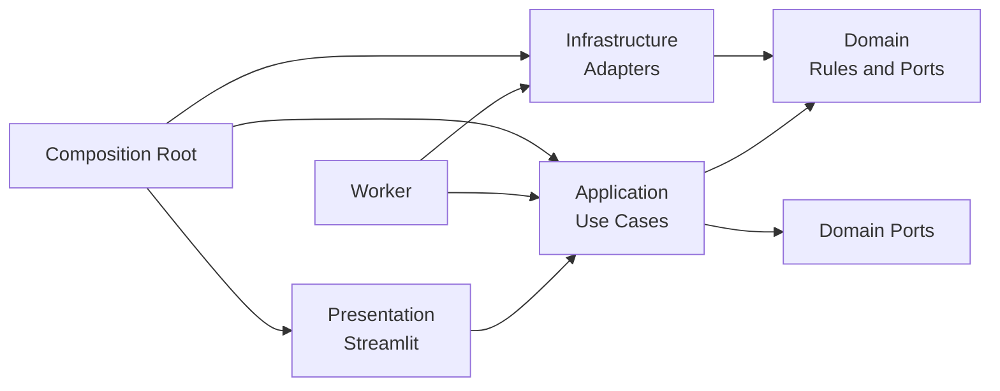

# AI Resume Analyzer: Project Structure

**Status:** Current MVP structure and production roadmap  
**Date:** 19 August 2026  
**Architecture style:** Modular monolith with ports and adapters  
**Runtime:** Streamlit web process with synchronous provider calls

The implemented MVP is intentionally smaller than the production blueprint:
it supports pasted resume text, validated analysis, and in-memory Streamlit
session state. Additional worker, persistence, identity, upload, report, and
job-provider modules are roadmap boundaries rather than current files.

## 1. Folder Structure

```text
Resume-Analyser-19-08-2026/
|
|-- app.py                              # Streamlit application entry point
|-- worker.py                           # Analysis worker entry point
|-- pyproject.toml                      # Dependencies and tool configuration
|-- README.md                           # Setup, usage, and operational quick start
|-- Product_discovery.md                # Product requirements and scope
|-- Architecture.md                     # System architecture and technical decisions
|-- PROJECT_STRUCTURE.md                # This implementation blueprint
|-- .env.example                        # Safe configuration template
|-- .gitignore                          # Secrets, runtime files, and local artifacts
|-- LICENSE
|
|-- src/
|   |-- resume_analyzer/
|       |-- __init__.py
|       |-- config.py                    # Typed environment-backed settings
|       |-- container.py                 # Dependency injection and composition root
|       |
|       |-- presentation/               # Streamlit-only code
|       |   |-- __init__.py
|       |   |-- streamlit_app.py          # Current MVP workflow and rendering
|       |
|       |-- application/                 # Use cases and orchestration
|       |   |-- __init__.py
|       |   |-- services/
|       |   |   |-- __init__.py
|       |   |   |-- analyze_resume.py     # Validate input and invoke provider
|       |
|       |-- domain/                      # Framework-independent business core
|       |   |-- __init__.py
|       |   |-- entities.py               # Resume, Analysis, Job, Report entities
|       |   |-- value_objects.py          # IDs, confidence, score, date ranges
|       |   |-- enums.py                  # Statuses, roles, evidence types
|       |   |-- rules.py                  # Domain validation and business rules
|       |   |-- scoring.py                # Explainable matching calculations
|       |   |-- ports.py                  # Protocols for repositories and providers
|       |   |-- exceptions.py             # Domain-level exceptions
|       |   |-- schemas.py                # Domain serialization boundaries
|       |
|       |-- infrastructure/              # External systems and technical adapters
|       |   |-- __init__.py
|       |   |-- persistence/
|       |   |   |-- __init__.py
|       |   |   |-- database.py            # SQLite engine and connection lifecycle
|       |   |   |-- unit_of_work.py         # Transaction boundary
|       |   |   |-- migrations/
|       |   |   |   |-- 001_initial.sql
|       |   |   |   |-- 002_analysis_metadata.sql
|       |   |   |-- repositories/
|       |   |       |-- resume_repository.py
|       |   |       |-- analysis_repository.py
|       |   |       |-- job_repository.py
|       |   |       |-- report_repository.py
|       |   |       |-- consent_repository.py
|       |   |       |-- audit_repository.py
|       |   |       |-- analysis_job_repository.py
|       |   |
|       |   |-- parsing/
|       |   |   |-- __init__.py
|       |   |   |-- file_validator.py       # Type, size, malware, and readability checks
|       |   |   |-- pdf_parser.py
|       |   |   |-- docx_parser.py
|       |   |   |-- ocr_adapter.py
|       |   |   |-- section_detector.py
|       |   |   |-- text_normalizer.py
|       |   |
|       |   |-- ai/
|       |   |   |-- __init__.py
|       |   |   |-- openai_client.py         # OpenAI SDK wrapper and timeouts
|       |   |   |-- prompts/
|       |   |   |   |-- resume_analysis.py
|       |   |   |   |-- summary_generation.py
|       |   |   |   |-- skill_gap_analysis.py
|       |   |   |   |-- recommendation_explanation.py
|       |   |   |-- schemas.py               # Typed GPT response schemas
|       |   |   |-- guardrails.py            # Evidence, safety, and output checks
|       |   |   |-- token_budget.py
|       |   |   |-- model_registry.py         # Model and prompt versions
|       |   |
|       |   |-- jobs/
|       |   |   |-- __init__.py
|       |   |   |-- provider_adapter.py      # External job source client
|       |   |   |-- normalizer.py             # Provider-to-domain mapping
|       |   |   |-- freshness.py              # Expiry and freshness policy
|       |   |   |-- match_engine.py            # Matching and explanation assembly
|       |   |
|       |   |-- storage/
|       |   |   |-- __init__.py
|       |   |   |-- file_store.py             # Storage protocol implementation
|       |   |   |-- local_file_store.py
|       |   |   |-- object_file_store.py       # Future multi-host adapter
|       |   |   |-- checksums.py
|       |   |
|       |   |-- reporting/
|       |   |   |-- __init__.py
|       |   |   |-- pdf_renderer.py
|       |   |   |-- report_template.py
|       |   |   |-- accessibility.py
|       |   |
|       |   |-- auth/
|       |   |   |-- __init__.py
|       |   |   |-- provider.py               # Authentication provider port
|       |   |   |-- session_auth.py
|       |   |   |-- role_mapper.py
|       |   |
|       |   |-- observability/
|       |       |-- __init__.py
|       |       |-- logging.py                # Redacting structured logger
|       |       |-- metrics.py
|       |       |-- audit.py                  # Security and business audit events
|       |       |-- tracing.py
|       |
|       |-- worker/                       # Durable background processing
|           |-- __init__.py
|           |-- runner.py                  # Polling, graceful shutdown, leases
|           |-- handlers.py                # Job-type dispatch
|           |-- analysis_handler.py        # Resume analysis workflow
|           |-- retry.py                   # Backoff and retry classification
|           |-- health.py
|
|-- tests/
|   |-- conftest.py                       # Shared fixtures and dependency overrides
|   |-- unit/
|   |   |-- domain/
|   |   |   |-- test_rules.py
|   |   |   |-- test_scoring.py
|   |   |   |-- test_value_objects.py
|   |   |-- application/
|   |       |-- test_submit_resume.py
|   |       |-- test_run_analysis.py
|   |       |-- test_recommend_jobs.py
|   |       |-- test_authorization.py
|   |       |-- test_delete_user_data.py
|   |-- integration/
|   |   |-- persistence/
|   |   |   |-- test_repositories.py
|   |   |   |-- test_transactions.py
|   |   |   |-- test_job_claiming.py
|   |   |-- parsing/
|   |   |   |-- test_pdf_parser.py
|   |   |   |-- test_docx_parser.py
|   |   |-- ai/
|   |   |   |-- test_openai_adapter.py
|   |   |-- reporting/
|   |       |-- test_pdf_renderer.py
|   |-- contract/
|   |   |-- test_openai_schema.py
|   |   |-- test_job_provider_schema.py
|   |   |-- test_report_contract.py
|   |-- security/
|   |   |-- test_authorization_matrix.py
|   |   |-- test_file_upload_security.py
|   |   |-- test_prompt_injection.py
|   |   |-- test_report_access.py
|   |-- e2e/
|       |-- test_candidate_workflow.py
|       |-- test_counselor_sharing.py
|       |-- test_data_deletion.py
|   |-- fixtures/
|       |-- resumes/
|       |   |-- student_resume.pdf
|       |   |-- professional_resume.docx
|       |   |-- malformed_resume.pdf
|       |-- ai_responses/
|       |   |-- valid_analysis.json
|       |   |-- invalid_analysis.json
|       |-- jobs/
|           |-- sample_jobs.json
|
|-- scripts/
|   |-- migrate.py                         # Apply database migrations
|   |-- run_worker.py                      # Local worker launcher
|   |-- seed_jobs.py                       # Development-only job fixtures
|   |-- evaluate_models.py                 # Offline quality evaluation
|   |-- export_metrics.py
|
|-- data/                                  # Runtime-only; never commit user data
|   |-- .gitkeep
|   |-- resumes/.gitkeep
|   |-- reports/.gitkeep
|   |-- sqlite/.gitkeep
|
|-- docs/
|   |-- runbook.md                         # Incident and operational procedures
|   |-- data-retention.md
|   |-- model-evaluation.md
|   |-- threat-model.md
|   |-- adr/
|       |-- 0001-modular-monolith.md
|       |-- 0002-sqlite-boundary.md
|       |-- 0003-openai-adapter.md
|       |-- 0004-durable-analysis-worker.md
|
|-- .github/
    |-- workflows/
        |-- ci.yml
        |-- security.yml
        |-- release.yml
```

## 2. File Names and Purpose

### Root files

| File | Purpose | Primary responsibility |
|---|---|---|
| `app.py` | Streamlit launcher | Create the dependency container, configure the page, and delegate to presentation code. |
| `worker.py` | Worker launcher | Create the same application dependencies and start durable job processing. |
| `pyproject.toml` | Project manifest | Declare runtime and development dependencies, Python version, Pytest, linting, formatting, type checking, and coverage settings. |
| `.env.example` | Configuration reference | Document required variable names and safe example values without secrets. |
| `.gitignore` | Repository hygiene | Exclude `.env`, SQLite files, uploaded resumes, reports, caches, and local logs. |
| `README.md` | Developer entry point | Document installation, local startup, testing, migrations, and architecture links. |
| `Product_discovery.md` | Product contract | Define users, requirements, acceptance criteria, risks, and future scope. |
| `Architecture.md` | Technical architecture | Explain system boundaries, runtime topology, security, observability, and deployment decisions. |
| `PROJECT_STRUCTURE.md` | Implementation map | Explain where code belongs and how modules may depend on one another. |

### Application package

| File or directory | Purpose | Responsibility |
|---|---|---|
| `config.py` | Typed configuration | Load and validate environment-backed settings such as database path, file limits, model, timeouts, and retention. |
| `container.py` | Composition root | Instantiate adapters, repositories, policies, and services. This is the only normal place that wires concrete implementations. |
| `presentation/` | UI boundary | Translate Streamlit events and session state into application commands and render result DTOs. |
| `application/commands.py` | Command DTOs | Define validated inputs for operations that change state. |
| `application/queries.py` | Query DTOs | Define inputs for reads without exposing database models to the UI. |
| `application/results.py` | Result DTOs | Provide stable, presentation-safe output models. |
| `application/services/` | Use cases | Coordinate authorization, domain rules, transactions, ports, and state transitions. |
| `application/policies/` | Cross-cutting use-case policies | Centralize authorization, retention, and retry decisions that are not UI concerns. |
| `domain/entities.py` | Business entities | Model resumes, analyses, findings, skills, jobs, recommendations, reports, consent, and audit records. |
| `domain/value_objects.py` | Immutable validated values | Model opaque IDs, confidence values, fit scores, date ranges, and checksums. |
| `domain/enums.py` | Controlled vocabulary | Define job states, roles, evidence sources, recommendation bands, and error categories. |
| `domain/rules.py` | Business invariants | Enforce facts such as valid state transitions, evidence requirements, and user-edit rules. |
| `domain/scoring.py` | Explainable scoring | Compute deterministic skill and job-fit factors without protected attributes. |
| `domain/ports.py` | Dependency inversion boundary | Define Protocol interfaces for persistence, AI, parsing, job data, files, identity, reports, and time. |
| `domain/exceptions.py` | Domain errors | Define errors that application services can translate into stable user-safe error codes. |

### Infrastructure package

| File or directory | Purpose | Responsibility |
|---|---|---|
| `persistence/database.py` | SQLite setup | Configure connections, WAL mode, foreign keys, busy timeout, and health checks. |
| `persistence/unit_of_work.py` | Transaction control | Group related writes and guarantee commit or rollback behavior. |
| `persistence/migrations/` | Schema evolution | Apply ordered, repeatable database migrations. |
| `persistence/repositories/` | Database adapters | Implement domain repository protocols using parameterized SQLite queries. |
| `parsing/file_validator.py` | Upload boundary | Validate detected content type, file size, page limits, malware status, and readability. |
| `parsing/pdf_parser.py` | PDF adapter | Extract text and layout evidence from PDF files. |
| `parsing/docx_parser.py` | DOCX adapter | Extract paragraphs, headings, tables, and metadata from DOCX files. |
| `parsing/ocr_adapter.py` | OCR adapter | Handle scanned documents only when enabled and within resource limits. |
| `parsing/section_detector.py` | Resume structure adapter | Identify standard resume sections and attach source evidence. |
| `ai/openai_client.py` | OpenAI adapter | Call GPT with bounded timeouts, retry rules, provider error mapping, and no UI concerns. |
| `ai/prompts/` | Prompt source | Keep prompts versioned by use case and separated from application orchestration. |
| `ai/schemas.py` | AI contracts | Define strict typed schemas for analysis, summary, skill gaps, and explanations. |
| `ai/guardrails.py` | AI output safety | Validate evidence grounding, confidence thresholds, prohibited attributes, and unsupported claims. |
| `ai/model_registry.py` | Model governance | Associate model, prompt, schema, and evaluation versions with every generation. |
| `jobs/provider_adapter.py` | Job provider adapter | Fetch external job records with timeouts, pagination, rate limits, and provider-specific error mapping. |
| `jobs/normalizer.py` | Job data normalization | Convert provider records into internal job and requirement models. |
| `jobs/match_engine.py` | Recommendation adapter | Combine deterministic matching with explainable transferable-skill analysis. |
| `storage/file_store.py` | Storage protocol implementation | Provide opaque-key read/write/delete operations for source resumes and reports. |
| `reporting/pdf_renderer.py` | Report adapter | Render approved structured data into an accessible PDF without calling AI. |
| `auth/` | Identity adapters | Translate external identity claims into internal users and roles. |
| `observability/` | Operational instrumentation | Emit redacted structured logs, metrics, traces, and business/security audit events. |

### Worker package

| File | Purpose | Responsibility |
|---|---|---|
| `worker/runner.py` | Durable worker loop | Poll and claim jobs, maintain leases, handle graceful shutdown, and enforce concurrency limits. |
| `worker/handlers.py` | Job dispatch | Map persisted job types to handler functions without embedding provider logic. |
| `worker/analysis_handler.py` | Analysis workflow | Parse a stored resume, invoke the AI application service, persist validated results, and record state transitions. |
| `worker/retry.py` | Retry policy | Classify transient versus permanent failures and calculate bounded backoff with jitter. |
| `worker/health.py` | Worker readiness | Report database, storage, and configuration health. |

## 3. Responsibilities by Layer

### Presentation layer

- Render Streamlit pages and reusable components.
- Maintain only UI state, such as selected analysis ID and pending form values.
- Validate basic input for immediate feedback, while treating application validation as authoritative.
- Call application services through injected interfaces.
- Render safe error messages and correlation IDs.
- Never import `sqlite3`, the OpenAI SDK, parser libraries, or filesystem code.

### Application layer

- Represent user intent as commands and queries.
- Authenticate and authorize every use case.
- Coordinate domain rules, repositories, providers, transactions, and audit events.
- Manage idempotency and durable analysis job submission.
- Return DTOs rather than ORM/database records.
- Translate internal exceptions into stable error categories.

### Domain layer

- Hold business meaning independent of Streamlit and infrastructure.
- Validate entities and value objects.
- Calculate explainable matching and prioritization rules.
- Define protocols for resources the business needs.
- Contain no network calls, SQL, environment reads, provider SDK imports, or UI code.

### Infrastructure layer

- Implement domain ports using SQLite, local/object storage, OpenAI, parsers, job providers, and PDF libraries.
- Translate external errors into application/domain error types.
- Apply technical controls such as timeouts, parameterized SQL, file limits, redaction, and connection handling.
- Keep provider-specific schemas at the boundary.

### Worker layer

- Execute long-running processing outside Streamlit request/session lifecycle.
- Claim work atomically and use leases to recover abandoned jobs.
- Enforce retry budgets and idempotency.
- Keep unrelated jobs running after an individual failure.

## 4. Dependency Relationships

### Allowed dependency graph



The practical direction is:

```text
presentation -> application -> domain
infrastructure -> domain
worker -> application
composition root -> all concrete implementations
```

The domain owns interfaces; infrastructure implements them. This is dependency inversion and allows tests to replace OpenAI, SQLite, file storage, and job providers with fakes.

### Allowed imports

| Source | May import | Example |
|---|---|---|
| `presentation` | `application`, presentation utilities, result DTOs | `RunAnalysisService`, `AnalysisResult` |
| `application` | `domain`, application DTOs, port interfaces | `AnalysisRepository`, `Resume` |
| `domain` | Python standard library and domain modules | `datetime`, `Protocol`, domain entities |
| `infrastructure` | `domain`, infrastructure modules, external SDKs | OpenAI SDK, SQLite driver, PDF parser |
| `worker` | `application`, `domain`, infrastructure composition | Analysis service and job repository |
| `container.py` | All concrete modules needed to wire dependencies | SQLite repository into a service |
| `tests` | Any production module under test and test utilities | Fakes, fixtures, services |

### Forbidden dependencies

- Domain code must not import Streamlit, OpenAI, SQLite, parser libraries, report libraries, or `config.py`.
- Streamlit pages must not make SQL queries, call external APIs, read private files, or instantiate providers.
- Application services must not import the OpenAI SDK, `sqlite3`, or parser-specific classes; use ports instead.
- Repositories must not contain recommendation policy, prompt construction, or UI formatting.
- AI adapters must not write directly to the database; application services own persistence and transactions.
- Tests must not use production user data or real API keys.
- `app.py` and `worker.py` must not contain business rules; they only configure and launch.

### Dependency injection rules

1. Define a port in `domain/ports.py` when a use case needs an external capability.
2. Implement the port in `infrastructure/`.
3. Construct the concrete adapter only in `container.py` or a test fixture.
4. Pass the port into an application service constructor.
5. Unit tests inject fakes or mocks without changing production code.

## 5. Testability Model

| Test level | Main target | Dependencies |
|---|---|---|
| Unit | Domain rules, scoring, policies, DTO validation | No database, network, filesystem, or Streamlit |
| Application | Use-case orchestration and transaction behavior | Fake ports and in-memory test objects |
| Integration | SQLite repositories, file parsers, OpenAI adapter, PDF renderer | Temporary database/files and fake or recorded providers |
| Contract | External provider schemas and AI structured output | Versioned fixtures and provider sandbox where available |
| Security | Authorization, uploads, prompt injection, report sharing | Test deployment and malicious fixtures |
| End-to-end | Candidate and counselor workflows | Test Streamlit deployment and controlled dependencies |

The largest amount of test coverage should sit in the domain and application layers. Infrastructure tests verify adapters and contracts, while a smaller E2E suite verifies that the composed application behaves correctly.

## 6. Scalability and Evolution Rules

### Initial deployment

- Run `app.py` as the Streamlit web process and `worker.py` as a separate process.
- Use SQLite with WAL mode on a persistent single-host volume.
- Use local private file storage behind `FileStore`.
- Keep AI analysis asynchronous through the SQLite-backed job table.

### Scale-up triggers

Replace SQLite with PostgreSQL when there are multiple web/worker hosts, frequent write contention, or queue volume that exceeds a single writer. Replace local file storage with object storage when hosts are ephemeral or horizontally scaled. Add a managed queue when job latency, throughput, or retry visibility requires it.

Because application services depend on ports and repositories rather than SQLite APIs, these migrations should affect infrastructure configuration and adapter implementations rather than the domain or Streamlit pages.

## 7. Naming and Coding Conventions

- Use `snake_case` for modules and functions, `PascalCase` for classes, and explicit names for DTOs and ports.
- Prefer one primary responsibility per module.
- Use type hints on public functions and protocols.
- Keep provider names in infrastructure modules, not business abstractions.
- Use immutable value objects for IDs, scores, confidence, and dates where practical.
- Keep functions small enough to test without Streamlit session state.
- Use stable error codes for UI and operational handling.
- Keep migrations append-only; never edit an applied migration.
- Do not commit secrets, real resumes, generated reports, production databases, or unredacted logs.

## 8. Implementation Order

1. Create the package and configuration boundary.
2. Implement domain entities, value objects, ports, exceptions, and deterministic scoring rules.
3. Add SQLite migrations, connection management, Unit of Work, and repositories.
4. Add file validation, PDF/DOCX parsing, and private file storage.
5. Implement the OpenAI adapter with typed schemas, guardrails, timeouts, and usage metadata.
6. Implement application services and the durable worker.
7. Add recommendation, reporting, sharing, deletion, and audit workflows.
8. Build Streamlit pages and components against result DTOs.
9. Add CI, security checks, model evaluation, deployment configuration, and operational runbooks.
